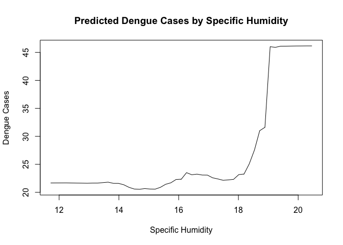
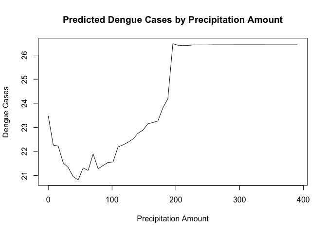
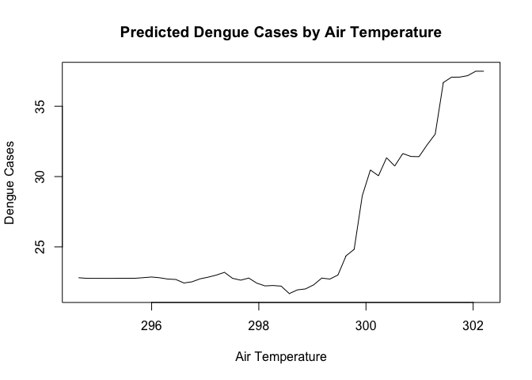
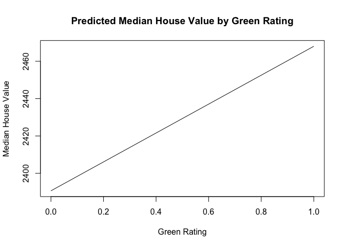
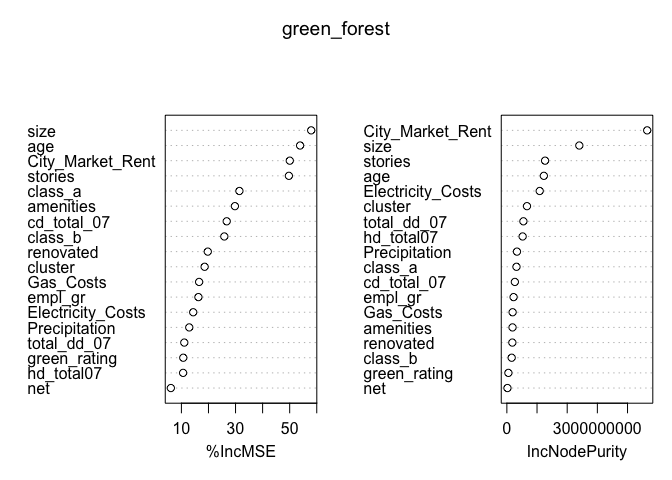
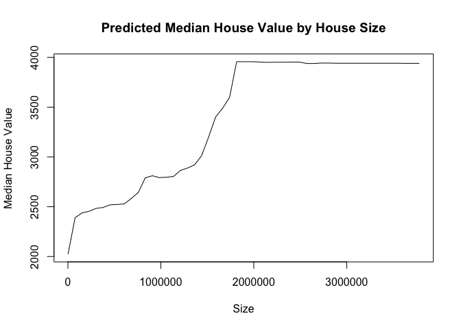
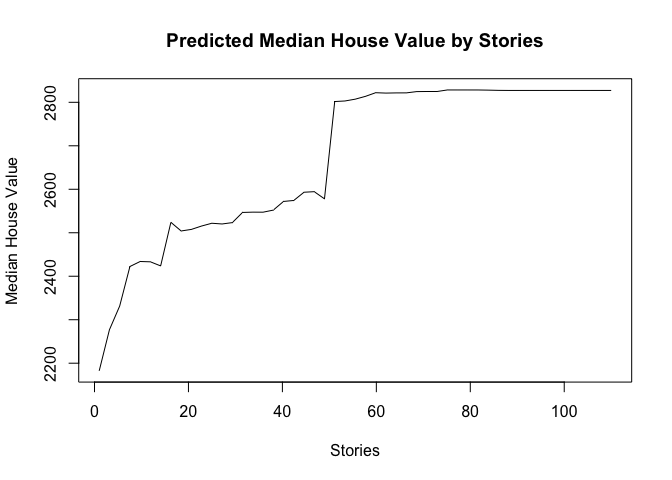
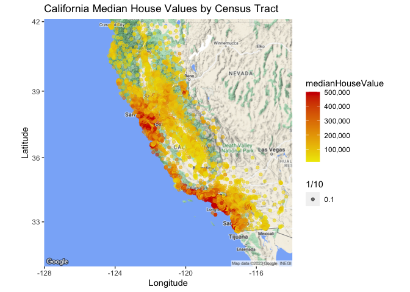
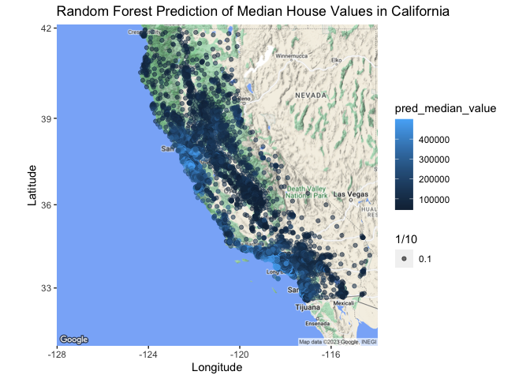
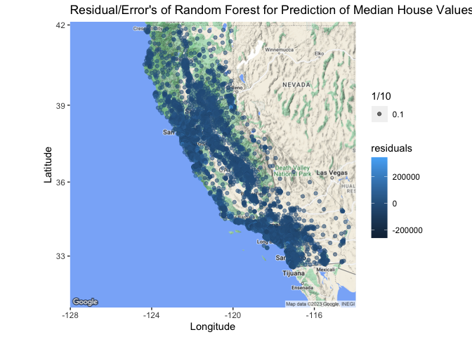

Data Mining HW 3
================
2023-03-26

\#Data Mining Homework 3 \##Saager Buch and Joe Monahan

\##Problem 1: What Causes What?

\###1

You can’t just run the regression of *Crime* on *Police* because there
are a significant number of confounding variables such as extra police
presence for heightened threat of terrorism or population size that
would cause the measurement to be skewed. The results from a regression
that does not control for this would be biased.

\###2

The researchers were isolated the effect of *Police* on *Crime* by using
the terrorism alert system as a control. When the threat level was
higher, police presence increased due to the threat of a potential
terrorist attack and this increased police presence was unrelated to the
amount of crime in the city. So, researchers could look at the effect
extra police on high alert days had on street crime. From Table 2, we
see the higher number of police on high alert days did indeed have a
negative effect on total daily crime. Crime was lower on high alert days
and the result is statistically significant at a 5% level.

\###3

The reason for controlling for Metro ridership was that there was a
potential that, on high alert days, there were less tourists and people
in general in D.C. area, meaning less potential for crime to occur. This
would be a confounding variable because it could decrease the
significance of any conclusion. However, the researchers found that
there was no real decrease in the amount of riders on high alert days.
Thus, controlling for Metro ridership means the researchers have a
stronger claim for causality.

\###4

The results in the first column are measuring the effect of *Police* on
*Crime* using high alert days and separating District 1 from the rest of
the districts. District 1 consists of the National Mall, which is also
where there are large amounts of tourists, the Smithsonian Museums, and
most importantly the White House. On high alert days, you would expect
more of the extra police force to be concentrated in this district
compared to the others. These results show there is a larger and
statistically significant reduction of crime in District 1 compared to
other districts. Additionally, the effect on the other districts is not
statistically significant. The conclusion is that researchers can now
use these results to provide more support to the argument that a
heightened police presence decreases crime levels.

\##Problem 2: Tree Modeling: Dengue Cases

                     names2 rmse_all2
    1                  CART     28.57
    2         Random Forest     26.03
    3 Gradient-Boosted Tree     26.74

We chose to predict dengue cases instead of of using a log
transformation because we are aware of the data in these two cities, so
using the actual data instead of a log transformation would more
accurately predict the severity of dengue. Additionally, these
predictions types are unaffected by monotonic transformations of
independent variables. Therefore, a log transformation is not explicitly
necessary in this case. In our models we chose to include the variables
*precipitation_amt*, *avg_temp_k*, *air_temp_k*, *specific_humidity*,
*tdtr_k*, *city*, *season*, *precip_amt_kg_per_m2*, and
*relative_humidity_percent*. First, we created a loop to give us 5 sets
of results for the CART, random forest, and boosted tree models. To give
us new sets of data each time, we included the train-test split within
the loop. We then took the mean RMSE for each model to help conclude
which model consistently outperforms the others. Below are the results:

We found that the random forest model had the lowest mean RMSE value of
26.1 whereas CART was 27.6 and GB Trees was 27.2. Therefore, we used the
random forest model for our three partial dependence plots.

Here is the first for *specific_humidity*,

<!-- -->

In the graph, we see a spike around 18 grams of water per kilogram of
air. From this graph, we can predict that dengue cases will spike is the
humidity is 18 or higher. As someone living in these cities, I would
read this as any humidity 18 grams or higher means a significantly
higher risk of dengue.

Here is the second plot for *precipitation_amt*,

<!-- -->

After 50 mm in rainfall a week, the amount of dengue cases rises as
precipiation amount increases. This makes sense especially when we
combine this with our conclusions from the first plot on humidity. With
more rainfall, there will be more humidity and more places for
mosquitoes to thrive, meaning a higher chance for dengue cases to rise.
However, the interesting part of this plot is for precipiation amounts
lower than 50 mm. We think that, the initial spike could be caused by
higher precipitation in week prior to the predicted one and then there
is a decrease because one specific week is dry and therefore mosquitoes
do not have room to thrive. Additionally, less precipitation could mean
warmer weather which would cause people to stay indoors and away from
mosquitoes, also reducing the number of cases.

For the third plot, we decided to use *air_temp_k* since both
precipitation and humidity amounts affect the air temperature. Here is
this plot,

<!-- -->

There is a large spike around 300 where there is a huge increase in
dengue cases. This could be another indicator for when to stay indoors
or when to only go outside covered up. Since air temperature does depend
on both humidity and precipitation, we chose this as our wild-card
variable.

\##Problem 3: Predictive model building: green certification

Our goal is to develop a predictive model for revenue per square foot
per calendar year and use it to investigate the impact of green
certification on rental income per square foot. To achieve this, we
begin by creating the variable *revenue,* which is the product of *Rent*
and *leasing_rate.* Our aim is to predict revenue per square foot per
calendar year. We explore multiple models, including a simple linear
regression model, a random forest model, and a gradient-boosted tree
model, to compare their performance.

Before fitting the models, we scrutinize the variables to determine
which ones to include. We remove *Rent* and *leasing_rate* since they
are already included under *revenue.* We also exclude *LEED* and
*Energystar* in favor of the combined *green_rating* variable as
mentioned in the question. We drop *Electricity_Costs* and *Gas_Costs*
but later include them as interaction variables with *net* to
investigate their effects. Finally, we discard the unique identifier
variable *CS_Property_ID.*

After selecting the relevant variables, we run each model 5 times in a
loop and calculate the average RMSE to assess their performance.

                     names3 rmse_all3
    1          Linear Model   1047.26
    2         Random Forest    781.55
    3 Gradient-Boosted Tree    974.01

From our results, we see that our random forest model gives us the
lowest RMSE and therefore performs the best out of the models. So, we
will use the random forest model to try and see what the impact of
*green_rating* is.

We can get an idea of the average change in rental income per square
foot linked with green certification by looking at a partial dependence
plot of *green_rating*. Here is what this looks like,

<!-- -->

As *green_rating* is a binary variable, we focus on the difference
between the values at 0 and 1. We observe that the difference is
approximately 70, which is quite small. This suggests that obtaining a
green certification might not have a substantial impact on the rental
income received. To gain a more comprehensive understanding of the
variable’s significance, we examine the variable importance plot
generated by our random forest model on the following page.

Here is the variable importance plot,

<!-- -->

Upon examining the variable importance plot, we observe that
*green_rating* is positioned near the bottom, indicating that it has
minimal impact on the model’s accuracy whether it is included or not.
However, we note that some other variables such as *size* and *stories*
are relatively more important. Consequently, we are interested in
exploring the effects of these variables and decide to investigate their
partial dependence plots to uncover any intriguing patterns. These plots
are presented on the subsequent page.

Here are the partial dependence plots for *size* and *stories*,

The observed effects are consistent with what we would anticipate. As
the building size increases, there is a corresponding increase in rental
income. Additionally, buildings with more stories tend to have higher
value. These trends are apparent in the partial dependence plots.
However, the plot for *stories* reveals a peculiar jump in revenue after
about 50 stories but then plateaus for buildings with more than 50
stories. We are intrigued by this finding and wonder whether it is due
to 50 stories being a distinction in building types to designate a
skyscraper or other valuable building.

Based on our findings, we discovered that having a green certification
for a building does not have a substantial impact on increasing the
rental income per square foot. This result was surprising to us, as we
anticipated that it would have a more noticeable effect. We found it
intriguing that variables such as *size* and *stories* have a greater
influence on the rental income, and can make a significant difference in
revenue.

\##Problem 4: Predictive model building: California housing

<!-- -->

                  names4 rmse_all4
    result  Linear Model  71469.52
           Random Forest  49136.41

Our objective is to construct a model that can forecast the median home
values in California. To achieve this, we introduced three new
variables, avg_pop, avg_Bed, avg_Rooms. These were created by dividing
the totalRooms and totalBedrooms by households and population divided by
households. The variables, avg_Bed and avg_Rooms, represent the average
number of rooms and bedrooms per household in each tract while the
variable, avg_pop, indicates the average household size in each tract.
For the models we removed the variables totalRooms and totalBedrooms.
The models used were linear and random forest. We repeat the process two
times and take the average RMSE from both models to evaluate their
performance.

<!-- -->

<!-- -->

After comparing the performance of our linear and random forest models,
we concluded that the random forest model outperformed the linear model
in predicting median home values given that the RMSE for the random
forest model was smaller and that of the linear model. Hence, we used
the random forest model to generate our predicted values, which we then
plotted on a map using the “ggmap” package. Furthermore, we aimed to
create a residual map to identify areas where our model had higher
prediction errors. To achieve this, we subtracted the predicted values
from the actual values to obtain the residual variable. We present the
three maps in the following three pages. The first map displays the
distribution of actual home values, indicating that high-valued homes
are mainly clustered around the coast and large cities. The second map
shows our predicted median values, which appear to be similar to the
actual values, indicating that our model performed reasonably well.
Finally, the residual map displays the difference between actual and
predicted values, represented by two dark colors for extremes and a
light color for residuals close to zero. In this case, a positive value
indicates that the actual value was higher than the predicted value, and
the red color represents under-predictions. From our observations, there
were more under-predictions than over-predictions, with the majority of
the inaccuracy occurring around more populated areas.
